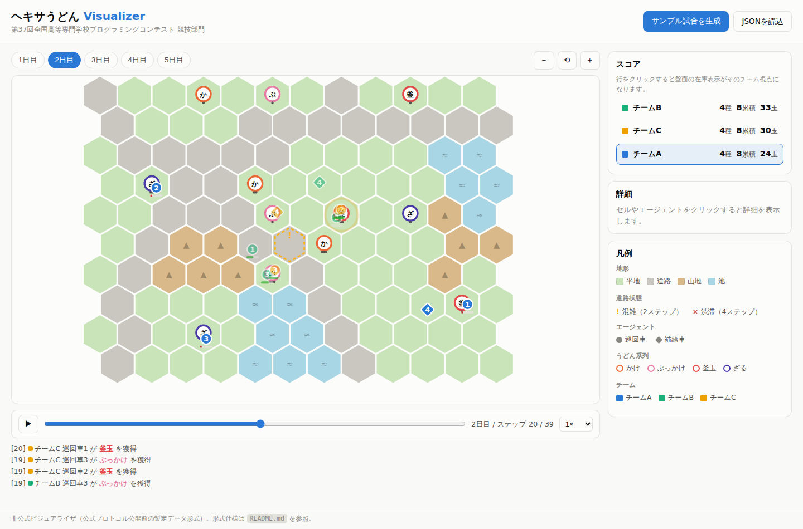

# ヘキサうどん Visualizer

第37回全国高等専門学校プログラミングコンテスト 競技部門「ヘキサうどん」の
**モック競技サーバー & 試合ビジュアライザ** です。

公式資料「競技部門『ヘキサうどん』のフォーマットについて」に準拠した JSON を
返すサーバー (FastAPI) と、試合をステップ単位で再生できるブラウザ UI から構成
されます。本番競技サーバーと同じく **HTTP/1.1** で応答します。

> ルールの概要と API エンドポイント仕様の一覧は [SPEC.md](SPEC.md) にまとめています。



## 起動方法

```bash
pip install -r requirements.txt
python app.py            # http://127.0.0.1:8000
# または
uvicorn app:app --http h11
```

ブラウザで http://127.0.0.1:8000 を開き、「サンプル試合を生成」を押してください。

## API（公式フォーマット準拠）

| メソッド/パス | 内容 |
|---|---|
| `GET /api/match` | **試合開始前のマップ構成フォーマット**（`startsAt` / `daySeconds` / `daySteps` / `map.cells`＝0:平地 1:道路 2:山地 3:池 / `spots{brand,pos,stocks}` / `agents` / `fuelLimits` / `players` / `busyThreshold` / `jammedThreshold`） |
| `GET /api/match/{day}` | **各日開始時の試合情報フォーマット**（`endsAt` / `day`＝0始まり / `agents{kind,pos,fuel}`＝kind 0:巡回車 1:補給車 / `others{id,agents}` / `traffics{pos,status}`＝status 0:順調 1:混雑 2:渋滞） |
| `POST /api/agents` | **エージェント種別の回答**（例 `[0,1,0,1]`）を公式仕様どおり検証 |
| `POST /api/actions?day=N` | **行動計画の回答**を検証（-1以下=待機 / 0〜5=方向。0:左上→時計回り。ステップ合計の一致・池/マップ外への移動を確認） |
| `POST /api/new?seed=&teams=&days=&agents=&width=&height=` | 新しいサンプル試合を生成 |
| `POST /api/live/new?seed=&teams=&…` | **ライブ対戦を開始**（チーム0=あなた。既定 teams=1 は他プレイヤー無しの1人プレイ、2以上でAIが加わる。下記） |
| `GET /api/live` | ライブ対戦の進行状況（状態・受付中の日・暫定順位） |
| `GET /api/replay` | ビジュアライザ用の試合データ一式（下記） |

FastAPI の自動ドキュメントは http://127.0.0.1:8000/docs で確認できます。

## ライブ対戦モード（自作プログラムで対戦）

`POST /api/live/new` で始まるライブ対戦では、`POST /api/actions` が検証だけで
なく**実際にその日を実行**します。チーム0があなたのプログラムです。既定
（`teams=1`）では**他チームは一切生成されず**、他プレイヤーとは無関係に
自分の巡回だけを確認できます。`teams` を2以上にすると内蔵の貪欲AIチームが
加わり、順位を競う対戦になります。

```
POST /api/live/new            試合開始（マップ生成）
GET  /api/match               マップ構成を取得
POST /api/agents              種別を提出 → 試合開始
┌─ 日ごとに繰り返し ─────────────────┐
│ GET  /api/match/{day}        当日の試合情報（位置・燃料・道路状態）│
│ POST /api/actions?day={day}  行動計画を提出 → その日が実行される  │
└──────────────────────────────┘
GET  /api/replay              全記録（ビジュアライザで観戦可能）
```

- 手順を誤ると `409`（理由付き）、計画が不正だと `422` が返ります。
- 実行中の燃料切れの移動は「補給されるまで待機」として扱われ、
  実際に実行された行動が記録されます。
- 途中経過も「**現在の試合を表示**」ボタンやデバッグ GUI でいつでも確認できます。
- 対戦クライアントの実装例: `python examples/client.py --seed 42`
  （通信手順と行動計画の組み立て方の見本。貪欲戦略で全日程を自動プレイ。
  戦略部分は `algorithm/template.py` を参照・改造）

### GUIで操作する: Play (`/play.html`)

自分でプログラムを書かなくても、ブラウザだけでライブ対戦の各エンドポイントを
操作できる画面です。

- 「ライブ対戦を開始」フォーム → 内部で `POST /api/live/new` を実行
- エージェント種別を選んで確定 → `POST /api/agents`
- **盤面でエージェントを選択 → 隣接セルをクリックすると1手ずつ移動**。
  ステップ・燃料の予算を画面上で追跡しながら行動計画を組み立てられる
  （「待機+1」「残り待機で埋める」「戻す」ボタンも用意）
- 全エージェントの計画が確定したら「行動計画を提出」→ `POST /api/actions`
  でその日が実際に実行され、次の日へ進む
- 試合終了後は結果を表示し、そのままビジュアライザへ遷移して観戦できる

## サーバーデバッグ GUI (`/debug`)

サーバーが内部に保持している試合データと API の入出力を、ブラウザから
そのまま確認できるデバッグ画面（FastAPI + Jinja2 のサーバーサイド描画）です。

| パス | 内容 |
|---|---|
| `GET /debug` | 試合サマリ（seed・チーム・daySteps・閾値など）、マップ SVG、スポット一覧、サーバー計算の最終結果 (`meta.expected`)、再生成フォーム |
| `GET /debug/day/{n}` | 各日の試合情報（endsAt・道路状態の内訳）、開始時点の盤面 SVG、全チームのエージェント（位置・燃料）と**行動計画のトレース**（ステップ合計が daySteps と一致するかの検算・到達セル） |
| `GET /debug/requests` | 直近200件の `/api/*` リクエストログ（メソッド・状態・所要時間・リクエスト/レスポンスボディ）。競技クライアントが送った回答と 422 の理由の確認に便利 |

- セルにマウスを乗せると番号・地形・道路状態、エージェントはチーム・種別・燃料を表示します。
- リクエストログは純 ASGI ミドルウェア（`visualizer/debugview.py`）で記録し、
  メモリ上（最大200件）にのみ保持します。

## ビジュアライザ用データ形式 (`hexaudon-official-v1`)

`GET /api/replay` と「JSONを読込」ボタンは、公式フォーマットの文書を束ねた
以下の形式を使います。

```jsonc
{
  "format": "hexaudon-official-v1",
  "meta": {                       // 補助情報（公式フォーマット外）
    "seed": 42,
    "teamNames": ["チームA", "チームB", "チームC"],
    "seriesNames": ["かけ", "ぶっかけ", "釜玉"],
    "expected": { /* サーバー側シミュレーションの最終スコア（検算用） */ }
  },
  "match": { /* 試合開始前のマップ構成フォーマット（公式そのまま） */ },
  "kinds": [ [0,0,0,1], ... ],    // エージェント種別の回答（公式）×チーム
  "days": [
    {
      "info":  { /* 各日開始時の試合情報フォーマット（公式・チーム0視点） */ },
      "plans": [ [[3,2,-4], ...], ... ]  // 行動計画の回答（公式）×チーム
    }
  ]
}
```

ブラウザ側 (`static/js/replay.js`) がこの公式データだけを使って試合を1ステップ
ずつ再実行し、アニメーション・スコア・イベントを構築します。再生結果は各日の
`info`（位置・燃料）および `meta.expected`（最終スコア）と突き合わせ、不一致が
あればコンソールに警告を出します。

## 再現している競技ルール

- 移動コスト: 平地2/山地3/道路1〜4ステップ（順調・混雑・渋滞）、池は進入不可
- 燃料: 平地1/山地2/道路2 を**出発セルの地形**で消費（巡回車のみ）
- 補給: 補給車と同セルに1ステップ以上滞在で満タン（上限 `fuelLimits`）
- スポット: 1巡回車1スポット1日1玉・チーム独立在庫・毎日 `stocks` まで補充
- 道路状態: 前日+前々日の全チーム滞在ステップ数÷チーム数を
  `busyThreshold` / `jammedThreshold` と比較して決定（初日は全て順調）
- 勝敗: ①種類数 → ②日ごとの種類数の累積 → ③玉数（④回答時間は模擬対象外）

## UI の使い方

- **日タブ / スライダー / ▶** で任意の日・ステップへ。Space=再生/停止、←→=1ステップ移動
- **スコアの行をクリック**すると、盤面のスポット在庫表示がそのチーム視点になります
- セル・エージェントを**ホバー/クリック**で詳細（地形・コスト・在庫・燃料）
- ドラッグでパン、ホイール/±ボタンでズーム
- 「JSONを読込」で `hexaudon-official-v1` 形式のファイルを直接可視化できます

## 構成

```
app.py                     FastAPI サーバー（公式フォーマット API + デバッグ GUI + 静的配信）
algorithm/
  template.py              行動計画アルゴリズムのテンプレート（試合状況→
                           移動JSON）。貪欲法の実装例つき。CLIでも実行可能
  README.md                algorithm/ の使い方
visualizer/
  hexgrid.py               六角形グリッド（odd-r）座標・方向コード変換
  pathfinding.py           地形コスト付き Dijkstra
  mapgen.py                マップ自動生成（連結性保証つき）
  hexaudon.py              試合を表す HexaUdon クラス（公式フォーマットの
                           キーと同名フィールドを持ち、模擬試合・ライブ対戦
                           両方をこのクラス1つで実行する）
  debugview.py             デバッグ GUI 用: SVG 描画・計画トレース・API ログ記録
templates/
  base.html ほか           デバッグ GUI（Jinja2: 概要 / 日別 / リクエストログ）
examples/
  client.py                ライブ対戦のサンプルクライアント（algorithm/template.py
                           の貪欲戦略を通信ループに組み込んだもの）
static/
  index.html / style.css   ビジュアライザ UI（ライト/ダーク対応）
  play.html                Play（GUIでライブ対戦を操作）
  js/replay.js             公式データからの試合再生エンジン
  js/render.js             SVG 盤面レンダラー（パン/ズーム・ツールチップ）
  js/timeline.js           再生コントローラー
  js/main.js               画面の結線・スコア/凡例/詳細パネル
  js/play.js               Play の結線（クリックで行動計画を組み立て提出）
```

## 備考

- 公式の通信プロトコル（エンドポイントの正式なパス等）は7月上旬公開予定と
  されているため、パスは `/api/...` の仮のものです。レスポンス/リクエストの
  **中身**は公式フォーマット資料に従っています。
- `POST /api/actions` の検証はフォーマット面（要素数・値域・ステップ合計・
  池/マップ外移動）のみで、燃料切れの判定までは行いません。
